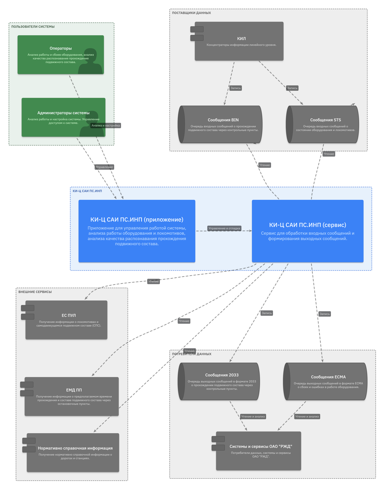
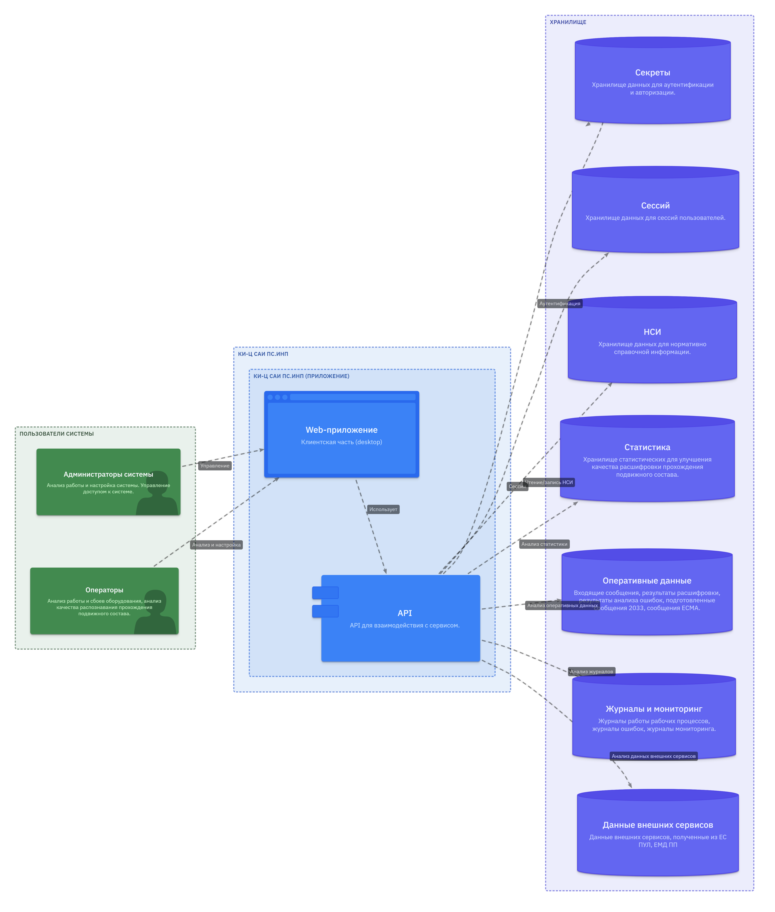
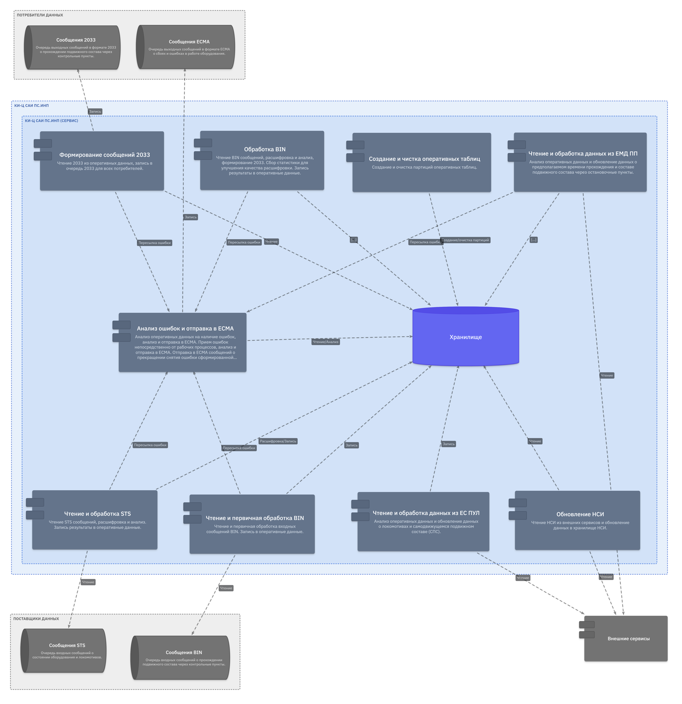

## Описание

Концентратор информации центрального уровня предназначен для отслеживания
в реальном времени прохождений железнодорожного подвижного состава через
контрольные пункты. Сервис должен

- обеспечивать нагрузку более 100 000 проездов в сутки
- расшифровку и анализ сообщений о проездах с учетом возможных ошибок и
  неправильной настройки оборудования
- расшифровку и анализ сообщений о состояние специального оборудования
- получения дополнительной информации из смежных сервисов РЖД
- хеширования данных для ускорения работы
- сохранения данных в БД для контроля работы сервиса и оборудования
- передачу расшифрованных данных и данных об ошибках в смежные системы
- сбор статистической информации для исправления ошибок
- сбор данных для логирования ошибок и мониторинга нагрузки
- поддержку клиентской части (SPA) для контроля и управления

## Пример использования C4

[Все диаграммы C4 для КИ-Ц САИ ПС.ИНП][c4-views]

### КИ-Ц САИ ПС.ИНП (ландшафт)

### КИ-Ц САИ ПС.ИНП (SPA)
Приложение для управления работой системы, анализа работы оборудования
и локомотивов, анализа качества распознавания прохождения подвижного
состава.

### КИ-Ц САИ ПС.ИНП (сервис)

Управление рабочими процессами, логирование исключений, сбор данных для
мониторинга.

[c4-views]: https://pankovan.github.io/C4/viewer/
